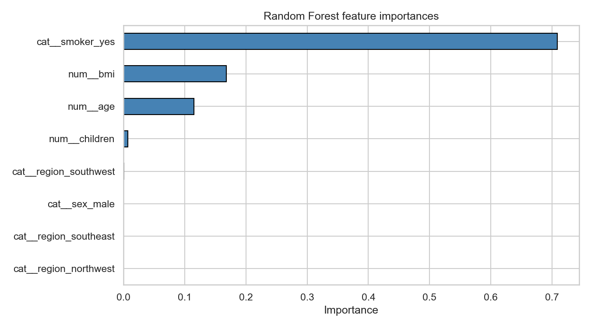
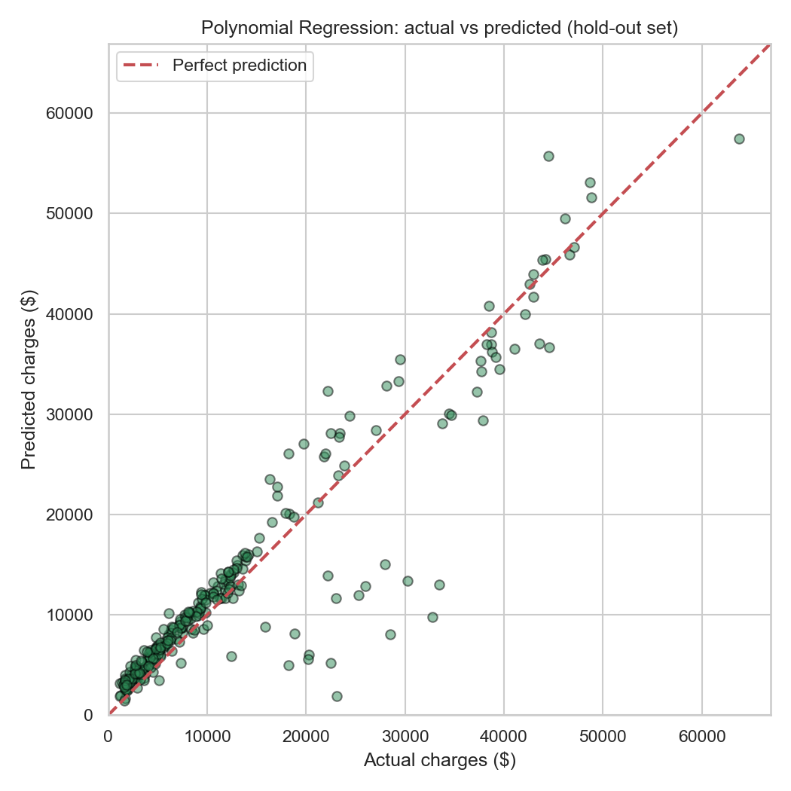

# Health Insurance Charge Prediction


Predicting individual medical insurance charges from demographic and lifestyle factors, and comparing five regression models on the task.

> **Companion article:** I wrote about the theory behind these models — their strengths, limits, and the challenges of regression in practice — in [Can Machines Predict Your Future? Exploring the Power and Limits of Regression](https://www.linkedin.com/pulse/can-machines-predict-your-future-exploring-power-limits-dabrase-42jzc/). This project is the hands-on demonstration of those ideas.


## Dataset

The classic [Medical Cost Personal Dataset](https://www.kaggle.com/datasets/mirichoi0218/insurance) (1,338 rows), included here as [`insurance.csv`](insurance.csv).

| Column     | Description                                              |
| ---------- | -------------------------------------------------------- |
| `age`      | Age of the primary beneficiary                           |
| `sex`      | Gender (`female`, `male`)                                |
| `bmi`      | Body mass index (kg/m²)                                  |
| `children` | Number of dependents covered by the plan                 |
| `smoker`   | Smoking status (`yes`, `no`)                             |
| `region`   | US region (`northeast`, `northwest`, `southeast`, `southwest`) |
| `charges`  | **Target** — individual medical costs billed by insurance |

## Project structure

The notebook and the script run the **same analysis** (same pipelines, same cross-validation folds, same numbers) in two formats:

| File | Purpose |
| ---- | ------- |
| [`Insurance.ipynb`](Insurance.ipynb) | Guided walkthrough: EDA with visualizations, then the model comparison with step-by-step explanations of each algorithm and design choice |
| [`InsurancePrediction.py`](InsurancePrediction.py) | The same analysis as a standalone, fully documented script — runs end-to-end and saves metrics + figures |
| [`insurance.csv`](insurance.csv) | Dataset |
| `results/` | Metrics table and figures generated by the script |

## Quickstart

```bash
pip install -r requirements.txt

# Run the full training/evaluation script
python InsurancePrediction.py

# Or explore the notebook
jupyter notebook Insurance.ipynb
```

The script writes `model_metrics.csv` and all figures to `results/`.

## Results

All models share an identical preprocessing pipeline (standard-scaled numeric features + one-hot encoded categoricals) and are evaluated on the same 5-fold cross-validation splits. Ridge, Lasso, and Random Forest are tuned with `GridSearchCV`.

| Model | R² (CV mean) | MAE ($) | RMSE ($) |
| --- | --- | --- | --- |
| **Random Forest** | **0.855** | **2,536** | **4,547** |
| Polynomial Regression (deg=2) | 0.835 | 2,913 | 4,834 |
| Linear Regression | 0.740 | 4,203 | 6,077 |
| Ridge Regression | 0.740 | 4,204 | 6,077 |
| Lasso Regression | 0.740 | 4,204 | 6,078 |

## Key findings

- **Smoking is by far the strongest cost driver.** Smokers pay roughly $23,000 more on average, dwarfing every other feature.
- **BMI and age come next**, and their effect is amplified for smokers — the interaction is why non-linear models win.
- The three linear models perform almost identically (R² ≈ 0.74); regularization adds little because the feature space is small and not collinear.
- Adding non-linearity — either tree ensembles or simple degree-2 polynomial interactions — cuts prediction error by roughly a third.





## Models compared

- **Linear Regression** — simple, interpretable baseline for linear relationships.
- **Ridge Regression** — L2 regularization; handles multicollinearity (alpha tuned via grid search).
- **Lasso Regression** — L1 regularization; performs implicit feature selection (alpha tuned via grid search).
- **Random Forest** — ensemble of decision trees; captures non-linearities and interactions out of the box (depth/leaf size tuned via grid search).
- **Polynomial Regression (degree 2)** — linear model on squared and interaction terms; nearly matches the forest while staying interpretable.

## Concepts demonstrated

The challenges discussed in the [companion article](https://www.linkedin.com/pulse/can-machines-predict-your-future-exploring-power-limits-dabrase-42jzc/) show up concretely in this project:

| Concept | Where it appears |
| --- | --- |
| **Overfitting vs underfitting** | An unconstrained Random Forest memorizes this small dataset (train R² ≈ 0.97); grid-searching `max_depth` and `min_samples_leaf` regularizes it. Polynomial degree is kept at 2 for the same reason. |
| **Multicollinearity / dummy-variable trap** | `OneHotEncoder(drop="first")` drops one column per categorical feature so the linear models don't face perfectly collinear inputs. |
| **Regularization (L1 vs L2)** | Ridge and Lasso pipelines with `alpha` tuned by `GridSearchCV` — and a finding: they barely help here, because the feature space is small and not collinear. |
| **Data leakage prevention** | Scaling and encoding live *inside* each model's `Pipeline`, so they are re-fit on the training portion of every CV fold and never see test data. |
| **Fair model comparison** | All five models are scored on identical `KFold` splits with the same three metrics (R², MAE, RMSE). |
| **Interpretability trade-off** | Linear coefficients (fully interpretable) vs Random Forest feature importances (post-hoc explanation), with degree-2 polynomial regression as the interpretable non-linear middle ground. |

## Limitations & future work

- **Skewed target.** Charges are strongly right-skewed; modeling `log(charges)` could stabilize errors for the most expensive cases.
- **Stronger ensembles.** Gradient boosting (XGBoost / LightGBM) would be the natural next baseline beyond Random Forest.
- **Explainability.** SHAP values would give per-prediction explanations rather than global feature importances.
- **Uncertainty.** Prediction intervals (e.g. quantile regression or Bayesian methods) would quantify confidence around each estimate — important for a real pricing use case.
- **Small dataset.** 1,338 rows from a single snapshot; results may not generalize to other markets or time periods.
