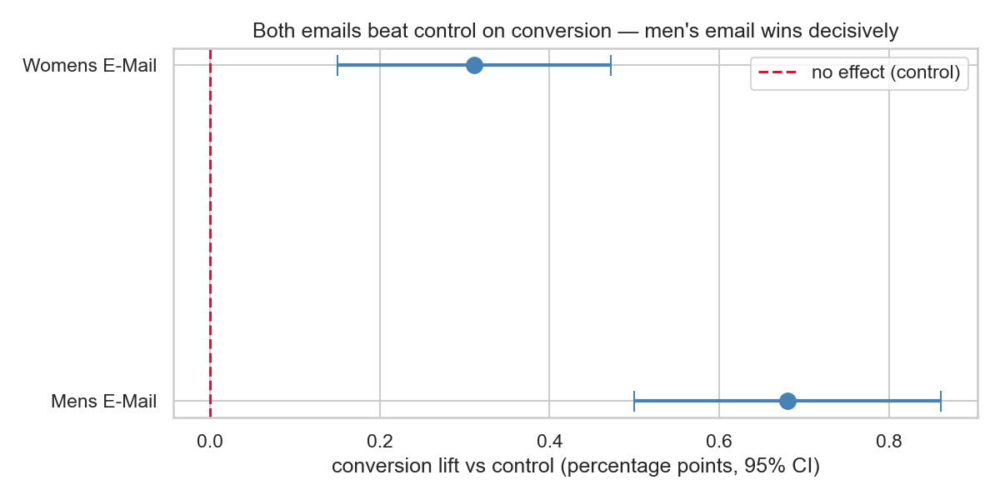

# A/B Testing: The Email That's Worth $58–92M a Year

**A real randomized experiment, analyzed end-to-end the way a decision worth millions deserves — plus a reusable Experiment Auditor that grades any A/B test and catches broken ones automatically.**

---

## The decision memo

A retailer randomly split 64,000 recent customers three ways: a men's merchandise email, a women's merchandise email, or no email (control), then tracked visits, purchases, and spend for two weeks. (Real data: the Hillstrom/MineThatData email test.)

**Recommendation: ship the men's email as the default campaign.**

| | Control | Women's email | **Men's email** |
|---|---|---|---|
| Visit rate | 10.6% | 15.1% | **18.3%** |
| Conversion rate | 0.57% | 0.88% | **1.25%** |
| Revenue per customer | $0.65 | $1.08 | **$1.42** |

- The men's email **more than doubles conversion** (+0.68pp, 95% CI +0.50 to +0.86, p = 1.5×10⁻¹³) and adds **+$0.77 revenue per send** (CI +$0.49 to +$1.06).
- All six confirmatory tests survive Holm multiple-comparison correction; a 10,000-resample bootstrap reproduces the parametric intervals to the cent.
- Scaled to a 10M-customer file with monthly sends: **$92M/year expected incremental revenue ($58M using the conservative CI bound)** against ~$120K of send costs.
- The experiment itself passes every validity check: sample-ratio p = 0.90, all covariate imbalances 10× below threshold.



## The Experiment Auditor

The reusable piece: point [`code/experiment_auditor.py`](code/experiment_auditor.py) at **any** A/B test CSV and it produces an automated health report — the five checks a competent experimenter runs before believing any result:

```bash
python code/experiment_auditor.py data/raw/hillstrom.csv \
    --group segment --outcome conversion --control "No E-Mail" \
    --post-treatment visit --post-treatment spend
```

```
[1] SAMPLE RATIO MISMATCH CHECK  ->  PASS      (chi-square vs designed split)
[2] COVARIATE BALANCE CHECK      ->  balanced  (worst |SMD| = 0.009, threshold 0.10)
[3] POWER CHECK                  ->  MDE 0.22pp; observed lift 0.68pp -> power ~100%
[4] PEEKING SIMULATION           ->  replay of p-values over time; stable signal
[5] VERDICT                      ->  SHIP: Mens E-Mail, +0.681pp, p=1.5e-13
```

Run it on a popular public ad-campaign dataset (588k users) and it **flags a Sample Ratio Mismatch automatically** — the observed 96/4 split is incompatible with an equal-allocation design, and the verdict flips to TEST INVALID until the true 96/4 design is supplied via `--expected-share`. A tool that catches a real design flaw in a real dataset in the wild:

```
[1] SAMPLE RATIO MISMATCH CHECK  ->  FAIL
    ad    n= 564,577  observed 96.00%  vs designed 50.00%
    psa   n=  23,524  observed  4.00%  vs designed 50.00%
    !! Split is incompatible with the design. Do not trust this
    !! experiment until the assignment mechanism is explained.
    ...
    RECOMMENDATION: TEST INVALID.
```

Full reports: [`assets/audit_hillstrom.txt`](assets/audit_hillstrom.txt), [`assets/audit_marketing_ab.txt`](assets/audit_marketing_ab.txt).

## Repository map

| Path | What it is |
|---|---|
| [`docs/01_theory.md`](docs/01_theory.md) | A/B testing theory for a non-statistician: p-values, power, the five classic pitfalls, the decision playbook |
| [`docs/02_technical_deep_dive.md`](docs/02_technical_deep_dive.md) | The math: z-test derivation, power formula, Holm mechanics, bootstrap, CUPED, Bayesian contrast |
| [`docs/03_stakeholder_faq.md`](docs/03_stakeholder_faq.md) | Every hard question a C-suite would ask, answered in two sentences + detail |
| [`code/01_eda.ipynb`](code/01_eda.ipynb) | Data validation, SRM check, randomization/balance audit |
| [`code/03_analysis.ipynb`](code/03_analysis.ipynb) | The test family, corrections, bootstrap cross-check, dollar projection |
| [`code/04_segmentation.ipynb`](code/04_segmentation.ipynb) | Per-segment effects (forest plot) + formal interaction tests |
| [`code/experiment_design.py`](code/experiment_design.py) | Power / MDE / sample-size calculator (run it: `python code/experiment_design.py`) |
| [`code/experiment_auditor.py`](code/experiment_auditor.py) | The auditor CLI |
| [`code/utils.py`](code/utils.py) | Tests, CIs, bootstrap, Holm, SRM — implemented from scratch with derivation comments |
| [`linkedin_post.md`](linkedin_post.md) | The non-technical communication artifact |

## Key concepts demonstrated

Experiment design (hypotheses, power analysis, MDE, pre-registration discipline) · validity engineering (SRM, covariate balance via standardized mean differences, pre- vs post-treatment variables) · inference (two-proportion z-tests, Welch's t, bootstrap, confidence intervals) · multiple-comparison control (Holm) · peeking / early-stopping hazards · heterogeneous treatment effects and interaction tests · statistical vs practical significance · translating lift into revenue.

## Reproduce it

```bash
pip install -r ../requirements.txt          # repo root requirements
python code/experiment_design.py            # design report
jupyter nbconvert --execute --inplace code/01_eda.ipynb code/03_analysis.ipynb code/04_segmentation.ipynb
python code/experiment_auditor.py data/raw/hillstrom.csv --group segment \
    --outcome conversion --control "No E-Mail" --post-treatment visit --post-treatment spend
```

`data/raw/hillstrom.csv` is committed (4 MB, public dataset). The second dataset is not committed (21 MB); see [`data/README.md`](data/README.md) for the one-line download.

## Honest limitations

- Two-week window: long-run effects (fatigue, unsubscribes, brand) are invisible here and would be guardrail metrics in a live rerun.
- Test population is customers active in the last 12 months; extrapolation to lapsed customers needs its own test.
- Segment-level findings are exploratory: the key interaction (men's email × past men's buyer) does not reach significance (p = 0.28), so targeting is a follow-up hypothesis, not a conclusion.
- This is a canonical public dataset (Hillstrom 2008), chosen precisely because it is a *genuine* randomized experiment with published results to sanity-check against — the analysis, tooling, and communication layer are the original work here.
