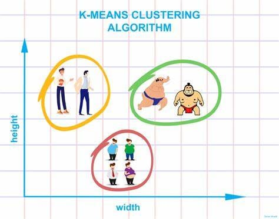

# Customer Segmentation (K-Means)

What distinct shopper personas exist by spending behavior and income — and how might marketing reach each?

## Skills

Python · scikit-learn · K-Means · StandardScaler · elbow method · PCA visualization

## Dataset

See [`data/README.md`](data/README.md) for source and download.

## Key findings

- The elbow method suggests ~4 clusters balancing WCSS and interpretability.
- Income vs. spending score reveals distinct personas (e.g. high income / low spend vs. high spenders).
- PCA projection makes cluster separation visible in 2D.



## Run

From this folder:

```bash
pip install -r ../requirements.txt
jupyter notebook notebook.ipynb
# or
python analysis.py
```

## Files

| File | Purpose |
| ---- | ------- |
| [`notebook.ipynb`](notebook.ipynb) | Clustering walkthrough |
| [`analysis.py`](analysis.py) | Same analysis as a script |
| [`data/`](data/) | Dataset |
| [`assets/`](assets/) | Preview images |
