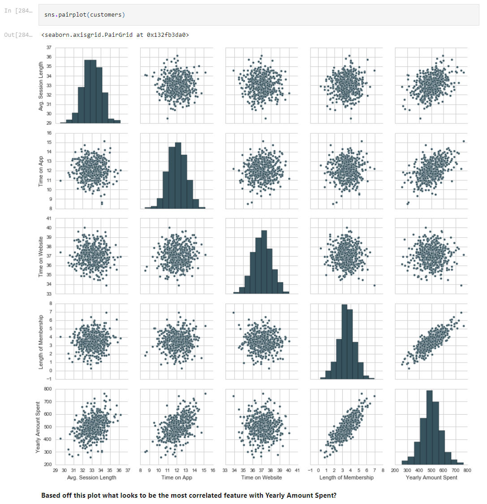

# E-Commerce Customer Spend (Linear Regression)

Predicting yearly customer spend from session length, app/website time, and membership duration using linear regression.

## Skills

Python · Pandas · scikit-learn · linear regression · train/test split · residual analysis · Seaborn pairplots

## Dataset

**Ecommerce Customers** CSV — bundled in [`data/`](data/) (see [data/README.md](data/README.md)).

| Column | Description |
| ------ | ----------- |
| Avg. Session Length | In-store advice session length |
| Time on App | Mobile app minutes |
| Time on Website | Website minutes |
| Length of Membership | Years as a member |
| Yearly Amount Spent | Target variable |

## Quickstart

```bash
pip install -r ../requirements.txt
jupyter notebook notebook.ipynb
# or
python analysis.py
```

## Key findings

- Length of membership is the strongest linear predictor of yearly spend.
- Time on App correlates more with spend than Time on Website.
- Residuals are approximately normal, supporting the linear model assumption.
- Pairplots reveal non-linear pockets that a simple linear model may miss.



## Project structure

| File | Purpose |
| ---- | ------- |
| [`notebook.ipynb`](notebook.ipynb) | EDA + linear regression walkthrough |
| [`analysis.py`](analysis.py) | Same analysis as a script |
| [`data/Ecommerce Customers.csv`](data/Ecommerce%20Customers.csv) | Dataset |
| [`assets/`](assets/) | Visualizations |
