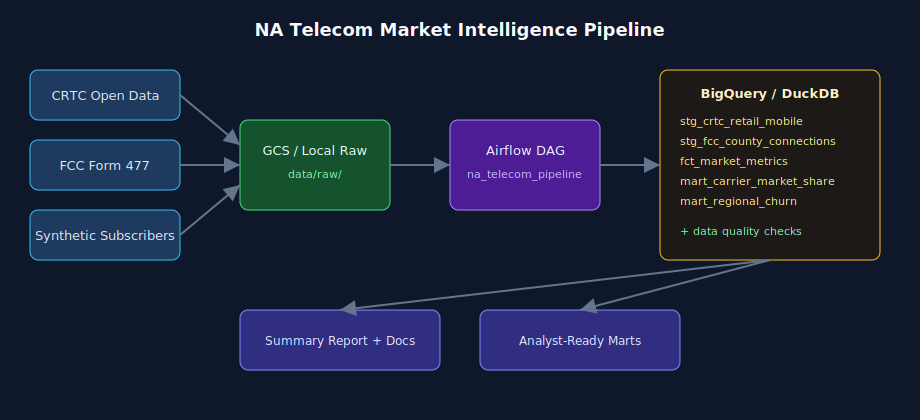

# North American Telecom Market Intelligence Pipeline


Batch data pipeline combining **real CRTC and FCC regulatory data** (Bell, Rogers, TELUS, Verizon, AT&T, T-Mobile) with a **synthetic subscriber operations layer**, orchestrated in **Airflow**, and modeled in **BigQuery / DuckDB** marts.

> **Summary report:** [SUMMARY_REPORT.md](docs/SUMMARY_REPORT.md) — conclusions, insights, and visualizations

> **Project guide:** [project_explained.md](docs/project_explained.md) — telecom industry context, analytics, and engineering concepts



## Business problem

Telecom strategy and data platform teams need one view of **market share**, **regional performance**, and **subscriber health** across Canada and the United States — not scattered regulator CSVs.

This pipeline mirrors the kind of **Market Intelligence & Subscriber Operations** system maintained at carriers and consultancies serving the NA telecom sector.

## Data sources

| Layer | Source | Real carriers |
|-------|--------|---------------|
| Canada market | [CRTC Retail Mobile Open Data](https://crtc.gc.ca/eng/publications/reports/policymonitoring/cmrd.htm) | Bell, TELUS, Rogers, Quebecor |
| US market | [FCC Form 477 County Data](https://www.fcc.gov/form-477-county-data-internet-access-services) | Verizon, AT&T, T-Mobile, Comcast |
| Operations | Synthetic (calibrated to CRTC benchmarks) | Mapped via `seeds/carrier_mapping.csv` |

See [docs/data_sources.md](docs/data_sources.md) for full attribution and licenses.

**Disclaimer:** Independent learning project. Synthetic subscriber data is clearly labeled. Not affiliated with any carrier or regulator.

## Sample insights

From the latest pipeline run (`mart_*` tables):

| Insight | Finding |
|---------|---------|
| Rogers share in Alberta (2024) | **27.9%** provincial mobile subscriber share — TELUS leads at ~49% (CRTC MB-F5) |
| Rogers share in BC (2024) | **40.9%** — reflects post-Shaw competitive dynamics in Western Canada |
| Churn reconciliation | Synthetic Top 3 churn **~1.09%** vs CRTC published benchmark **1.41%** (within pipeline tolerance) |
| Cross-border (BC/WA) | **1.26M** fixed broadband connections in Washington border counties (FCC sample) |

## Stack

Python · Pandas · Airflow · GCP (GCS + BigQuery) · DuckDB · SQL · Parquet · pytest

## Quickstart (local)

```bash
cd na-telecom-data-platform
python3 -m venv .venv && source .venv/bin/activate
pip install -r requirements-dev.txt

# Download CRTC data + generate marts
python scripts/download_all.py
python scripts/run_pipeline.py

# Run tests
pytest tests/ -v

# Regenerate summary report only (after pipeline has run)
python scripts/generate_report.py
```

Expected output: 8/8 quality checks pass; marts written to `data/warehouse/`; summary report at `docs/SUMMARY_REPORT.md`.

## Airflow (Docker)

```bash
export AIRFLOW_UID=$(id -u)
docker compose up airflow-init
docker compose up -d airflow-webserver airflow-scheduler
# UI: http://localhost:8080  (admin / admin)
# Unpause DAG: na_telecom_pipeline
```

## Cloud mode (optional)

```bash
export USE_GCS=1
export USE_BIGQUERY=1
export GCP_PROJECT=your-project
export GCS_BUCKET=your-bucket
export GOOGLE_APPLICATION_CREDENTIALS=/path/to/key.json
python scripts/run_pipeline.py
```

See [infra/terraform/README.md](infra/terraform/README.md) for GCS + BigQuery provisioning.

## Project structure

```
na-telecom-data-platform/
├── dags/na_telecom_daily.py     # Airflow DAG with TaskGroups
├── src/ingest/                  # CRTC, FCC, synthetic generators
├── src/transform/               # DuckDB + BigQuery loaders
├── src/quality/                 # Data quality expectations
├── sql/                         # Staging, dimensions, marts
├── seeds/                       # Carrier + province mappings
├── docs/                        # Architecture, business context
└── tests/                       # Ingest unit tests
```

## Key marts

| Mart | Grain | Use case |
|------|-------|----------|
| `mart_carrier_market_share` | carrier × region × year | Provincial mobile share (CA) + fixed connections (US) |
| `mart_regional_churn` | region × parent_group | Synthetic churn vs CRTC Top 3 benchmark |
| `mart_cross_border_summary` | CA/US border pairs | NA cross-border market view |

## Summary report

After the pipeline runs, open **[docs/SUMMARY_REPORT.md](docs/SUMMARY_REPORT.md)** for the project conclusion: executive summary, six visualizations, provincial share tables, churn reconciliation, cross-border analysis, limitations, and next steps.

Charts live in `assets/report/`.

## Project guide

For telecom industry background, how analytics and engineering concepts apply, and how the pipeline ties to business questions, read **[docs/project_explained.md](docs/project_explained.md)**.

For where code runs, terminal commands, and folder layout, read **[docs/how_it_works.md](docs/how_it_works.md)**.
