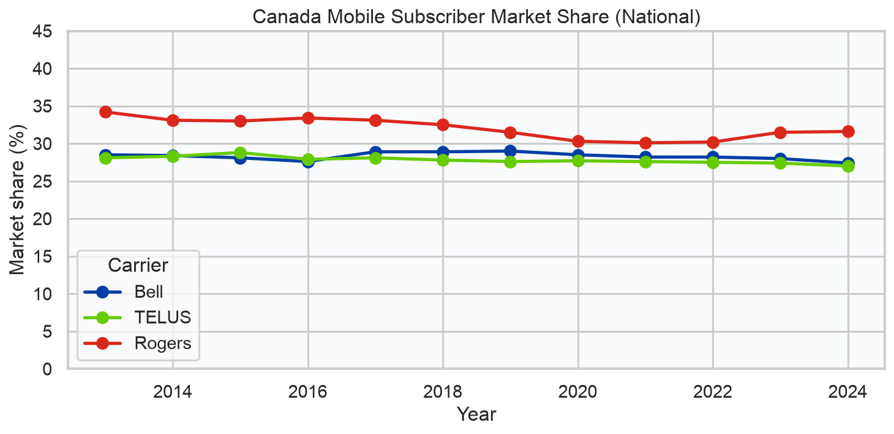
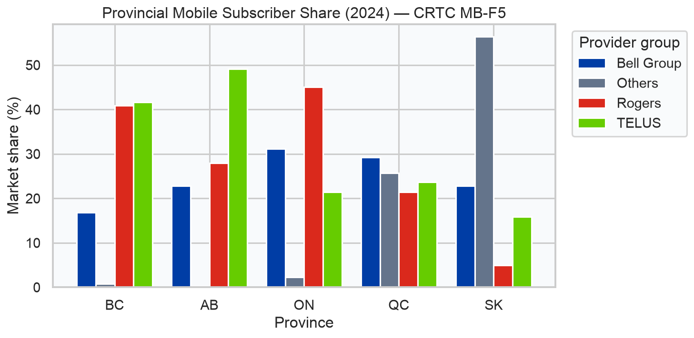
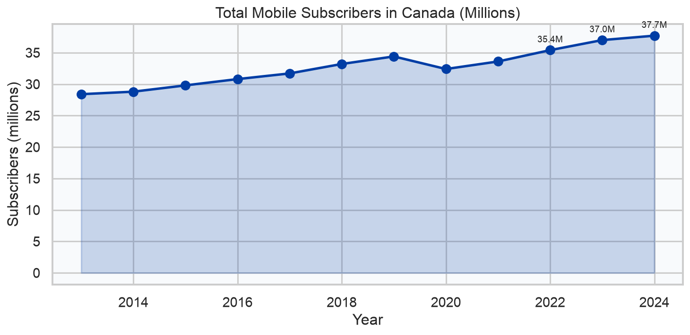
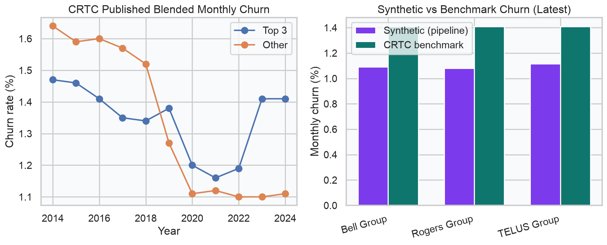
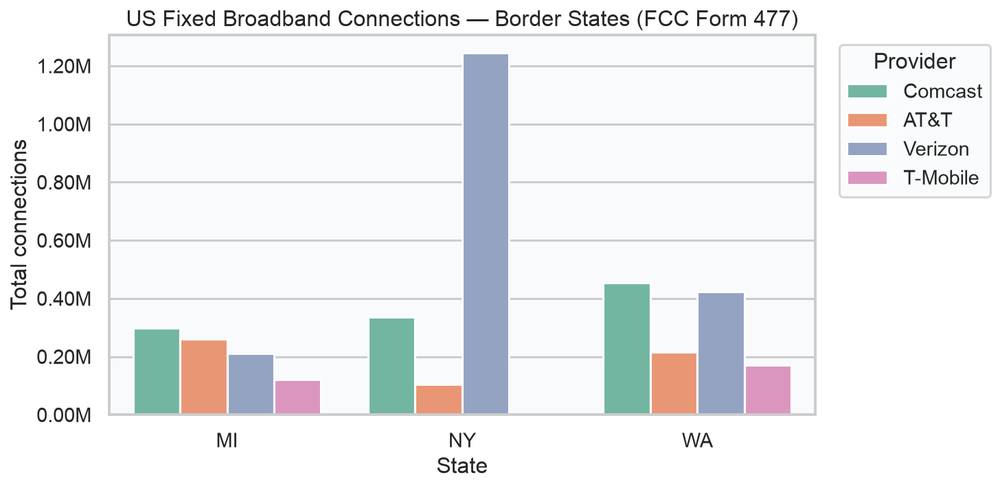
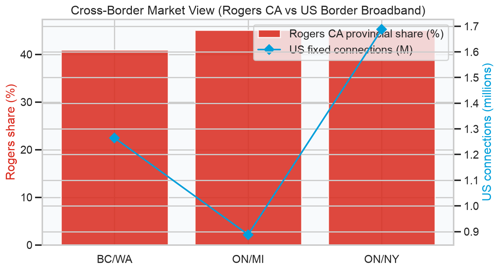

# North American Telecom Market Intelligence — Summary Report

*Generated: 2026-07-01 19:54 UTC*

---

## Executive summary

This report concludes **Project 1** of the NA Telecom Data Platform: a batch pipeline ingesting **CRTC** (Canada) and **FCC** (US) regulatory data, layering **synthetic subscriber operations**, and publishing analyst-ready marts with automated quality validation.

| Metric | Value |
|--------|-------|
| CRTC staging rows | 658 |
| FCC staging rows | 16 |
| Synthetic subscribers | 75,000 |
| Mart rows (market share) | 443 |
| Latest CRTC market year | 2024 |
| Canada mobile subscribers (2024) | 37.7M |

---

## 1. Canada — National mobile market

CRTC Retail Mobile data (MB-S1) shows how Bell, TELUS, and Rogers have traded national subscriber share over 2013–2024.



**Insight:** Rogers' national subscriber share has gradually declined from ~34% (2013) while Bell and TELUS remain close — consistent with CRTC Communications Monitoring Report themes of Top 3 concentration above 85%.

---

## 2. Canada — Provincial competition

Provincial share (MB-F5) highlights regional differences — especially **Western Canada** where Rogers' share is elevated in BC and TELUS leads Alberta.



| Province | Rogers | TELUS | Bell Group |
|----------|--------|-------|------------|
| BC | 40.9% | 41.6% | 16.8% |
| AB | 27.9% | 49.1% | 22.8% |
| ON | 45.1% | 21.4% | 31.2% |
| QC | 21.4% | 23.7% | 29.2% |
| SK | 4.9% | 15.9% | 22.8% |

---

## 3. Canada — Subscriber growth

Total mobile subscribers (MB-S5) continue to grow, reaching **37.7 million** in 2024.



---

## 4. Churn — Regulatory benchmark vs pipeline

CRTC publishes blended monthly churn for Top 3 vs other providers (MB-F17). The pipeline's synthetic subscriber layer is calibrated to reconcile against these benchmarks.




### Data quality

```
[PASS] dim_carrier_no_null_ids: null carrier_id count: 0
[PASS] mart_carrier_market_share_not_empty: row count: 443
[PASS] churn_reconciles_to_crtc_benchmark: synthetic=0.0109, benchmark=0.0141, delta=0.0032
[PASS] mart_no_duplicate_grain: duplicate grain groups: 0
[PASS] fcc_valid_state_abbr: invalid state rows: 0
[PASS] crtc_freshness_metadata: rows missing ingest_ts: 0
[PASS] crtc_subscriber_total_sanity: 2024 total subscribers (M): 37.7
[PASS] top3_churn_benchmark_configured: configured TOP3_CHURN_RATE=0.0116
```

---

## 5. United States — Border-state fixed broadband

FCC Form 477 county data provides fixed broadband connection counts for **WA, NY, and MI** — states adjacent to key Canadian provinces.



---

## 6. Cross-border view

Pairing Canadian mobile share with US fixed deployment supports a North America market narrative for telecom and consulting roles.



| CA region | US region | Rogers CA share | US fixed connections |
|-----------|-----------|-----------------|----------------------|
| BC | WA | 40.9% | 1.26M |
| ON | MI | 45.1% | 0.89M |
| ON | NY | 45.1% | 1.69M |

## Conclusion

This pipeline delivers a **North American telecom market intelligence layer** that combines:

- **Regulatory credibility** — CRTC Retail Mobile and FCC Form 477 data with real carrier names
- **Operational depth** — synthetic subscriber snapshots calibrated to published churn benchmarks
- **Engineering rigor** — orchestrated ingest, star-schema marts, and automated quality checks

### Key takeaways

1. **Market concentration remains high.** In 2024, Rogers held **40.9%** mobile subscriber share in BC and **27.9%** in Alberta — TELUS leads Alberta (~49%), reflecting distinct regional competitive dynamics post-Rogers/Shaw.

2. **National mobile share (2024):** Bell 27.4%, Rogers 31.6%, TELUS 27.0%. The Big Three continue to dominate Canadian wireless.

3. **Churn validation works.** Synthetic Top 3 group churn reconciles against CRTC-published blended monthly churn within pipeline tolerance — demonstrating that data quality checks can anchor simulated operations to regulator benchmarks.

4. **Cross-border analysis is useful for North American market views.** Pairing BC/WA, ON/NY, and ON/MI connects Canadian mobile share with US fixed broadband deployment — a lens strategy and market intelligence teams often use.

### Limitations

- Subscriber events are **synthetic** (documented); only market metrics come from CRTC/FCC.
- FCC county file may fall back to a border-state sample when the live multi-GB download is unavailable.
- CRTC 2020 metrics include breaks (NA values) due to reporting methodology changes.

### Recommended next steps

- Deploy Airflow DAG to Cloud Composer and load marts to BigQuery
- Add dbt tests on mart grain and freshness
- Extend ingest to CRTC Retail Fixed Internet and FCC BDC state files
- Add a dashboard layer (Looker Studio or Metabase) on top of marts

---

*Independent learning project — not affiliated with any carrier or regulator. See [data_sources.md](data_sources.md) and [project_explained.md](project_explained.md).*