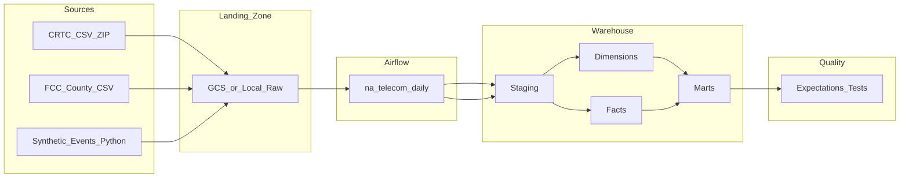

# Architecture

## Overview

Batch pipeline ingesting North American telecom regulatory data and synthetic subscriber operations into a cloud warehouse with orchestration and data quality checks.



## Modes of operation

| Mode | Landing | Warehouse | Use case |
|------|---------|-----------|----------|
| **Local** (default) | `data/raw/` | DuckDB + Parquet in `data/warehouse/` | Development, CI, portfolio demo |
| **Cloud** | GCS bucket | BigQuery dataset | Production-style deployment |

Set `USE_GCS=1` and `USE_BIGQUERY=1` with GCP credentials to enable cloud mode.

## DAG task groups

```
na_telecom_pipeline (daily 6 AM ET)
├── canada_market
│   └── ingest_crtc
├── us_market
│   └── ingest_fcc
├── operational
│   └── generate_subscriptions
├── load_staging
├── run_transforms
├── run_quality_checks
└── update_freshness_metadata
```

## Data model

See `sql/` for staging, dimension, fact, and mart definitions.

Grain definitions:

- `fct_market_metrics`: carrier × region × period × metric_name
- `fct_subscriber_snapshot`: subscriber × snapshot_date
- `mart_carrier_market_share`: carrier × region × year
- `mart_regional_churn`: region × month with benchmark reconciliation
