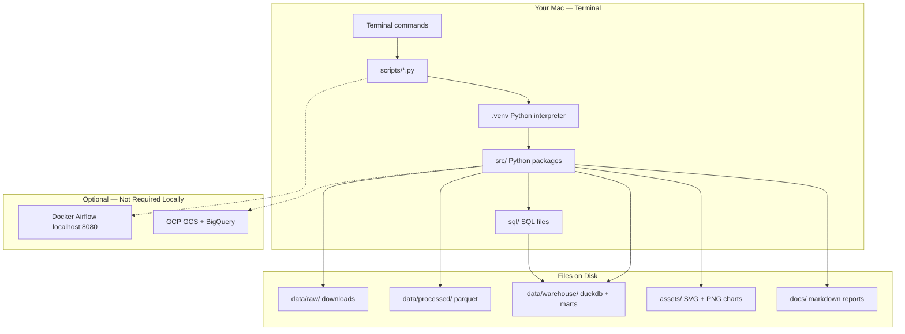
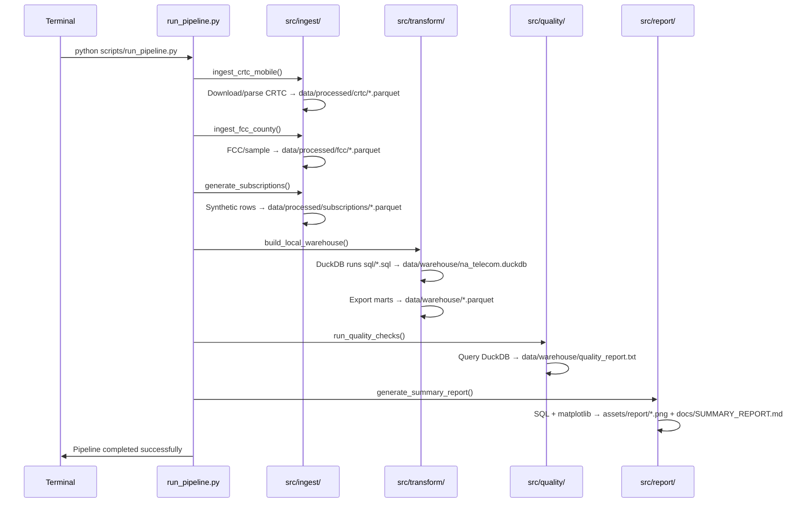
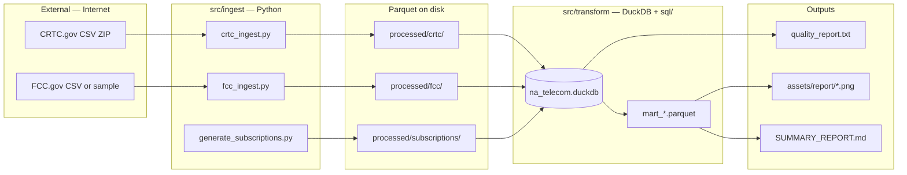
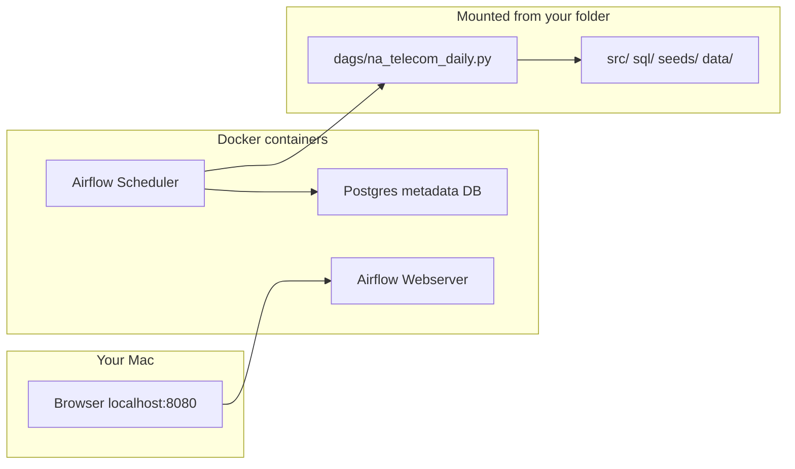

# How This Project Works — System Map

Where code runs, what each terminal command does, and how files connect.

---

## One-page mental model

Everything runs **on your Mac** in a terminal, inside a Python virtual environment (`.venv`). There is no cloud required for the default workflow. Python scripts read/write files on disk; DuckDB is a local database file; PNG/SVG images are **outputs for humans**, not inputs to the pipeline.



---

## Where Python actually runs

| What | Where it runs |
|------|----------------|
| `python scripts/run_pipeline.py` | Your terminal → `.venv/bin/python` → loads `src/` modules |
| `pytest tests/` | Same — local Python, no server |
| `python scripts/generate_report.py` | Same — reads DuckDB file, writes PNG + markdown |
| Airflow DAG | **Only if** you run `docker compose up` — then Python runs **inside Docker containers** |
| BigQuery / GCS | **Only if** you set `USE_GCS=1` and `USE_BIGQUERY=1` with GCP credentials |

**Default path:** 100% local. One Python process, one after another, writing files under `na-telecom-data-platform/`.

---

## Terminal commands you care about

```bash
cd na-telecom-data-platform
source .venv/bin/activate          # Use project Python + packages
pip install -r requirements-dev.txt # Once: install pandas, duckdb, matplotlib, etc.

python scripts/download_all.py     # Fetch CRTC ZIP + FCC/sample → data/raw/ + data/processed/
python scripts/run_pipeline.py     # Full pipeline (main entry point)
python scripts/generate_report.py  # Report only (needs warehouse already built)
pytest tests/ -v                   # Unit tests
```

### What `run_pipeline.py` does step by step



---

## Folder map — what lives where

```
na-telecom-data-platform/
│
├── scripts/              ← YOU RUN THESE (entry points)
│   ├── run_pipeline.py       Main: ingest → warehouse → quality → report
│   ├── download_all.py       Data download only
│   └── generate_report.py    Report/charts only
│
├── src/                  ← PYTHON LOGIC (imported by scripts, not run directly)
│   ├── config.py             Paths, URLs, env flags
│   ├── ingest/
│   │   ├── crtc_ingest.py    Download + parse CRTC CSVs
│   │   ├── fcc_ingest.py     Download + parse FCC data
│   │   ├── generate_subscriptions.py  Synthetic subscriber generator
│   │   └── utils.py          Shared helpers (parquet, download)
│   ├── transform/
│   │   ├── local_warehouse.py   DuckDB: load parquet, run SQL, export marts
│   │   └── bq_load.py           Optional BigQuery upload
│   ├── quality/
│   │   └── expectations.py      8 data quality checks
│   └── report/
│       └── generate_summary_report.py  Charts + SUMMARY_REPORT.md
│
├── sql/                  ← TRANSFORM RULES (read by DuckDB, not "run" in terminal)
│   ├── dimensions/           dim_carrier, dim_region, dim_date
│   ├── staging/              fact table builders
│   └── marts/                mart_carrier_market_share, churn, cross_border
│
├── seeds/                ← STATIC REFERENCE DATA (CSV)
│   ├── carrier_mapping.csv   Bell, Rogers, Verizon, etc.
│   └── province_mapping.csv  BC, AB, ON…
│
├── data/                 ← DATA FILES (created by pipeline)
│   ├── raw/                  Downloaded ZIPs/CSVs (gitignored if large)
│   ├── processed/            Cleaned parquet staging
│   └── warehouse/            na_telecom.duckdb + mart parquet + quality_report.txt
│
├── assets/               ← IMAGES (for humans reading docs)
│   ├── architecture.svg      Static diagram: pipeline architecture
│   └── report/*.png          Generated charts from summary report
│
├── docs/                 ← MARKDOWN (for humans)
│   ├── SUMMARY_REPORT.md     Auto-generated conclusions + embedded chart links
│   ├── project_explained.md  Industry + engineering guide
│   └── how_it_works.md       This file
│
├── dags/                 ← AIRFLOW (only when using Docker)
│   └── na_telecom_daily.py   Same steps as run_pipeline.py, scheduled
│
├── tests/                ← pytest (run via terminal)
└── docker-compose.yml    ← Optional Airflow stack
```

---

## Role of images

| Image | Created by | Purpose |
|-------|------------|---------|
| `assets/architecture.svg` | Hand-written (static) | Shows pipeline architecture in README — **documentation only**, not used by code |
| `assets/report/*.png` (6 files) | `generate_summary_report.py` at end of pipeline | Charts embedded in `docs/SUMMARY_REPORT.md` — **outputs of analysis**, regenerated each run |
| Charts are **not** fed back into the pipeline | | They summarize what's already in DuckDB/parquet |

Think of it as: **Python + SQL produce tables → matplotlib produces pictures → markdown ties the story together.**

---

## Data flow (core concepts)



### Concept glossary

| Concept | In this project |
|---------|-----------------|
| **Ingest / ETL extract** | Download CRTC/FCC, parse messy CSVs → parquet |
| **Staging** | Parquet files in `data/processed/` — cleaned but not yet modeled |
| **Warehouse** | DuckDB file holding tables (like a mini BigQuery on your laptop) |
| **Dimensions** | Reference tables: carriers, regions, dates |
| **Facts / Marts** | Business-ready tables: market share, churn, cross-border |
| **Orchestration** | `run_pipeline.py` runs steps in order; Airflow does the same on a schedule in Docker |
| **Data quality** | Rules in `expectations.py` that fail the run if numbers look wrong |

---

## Optional: Airflow (Docker)

If you run `docker compose up`, a **second runtime** appears:



The **same Python code** in `src/` runs, but Airflow decides *when* and tracks task success/failure. Your `data/` folder is shared into the container.

---

## Optional: GCP cloud mode

Set environment variables before running:

```bash
export USE_GCS=1 USE_BIGQUERY=1 GCP_PROJECT=... GCS_BUCKET=...
```

Then `bq_load.py` uploads parquet to **Google Cloud Storage** and **BigQuery** instead of (or in addition to) local DuckDB. Still triggered from your terminal — GCP is storage, not where Python installs.

---

## What to read first

1. Run once: `python scripts/run_pipeline.py`
2. Open: `docs/SUMMARY_REPORT.md` (results + charts)
3. Read: `docs/project_explained.md` (telecom + business context)
4. Trace code: `scripts/run_pipeline.py` → follow imports into `src/`
